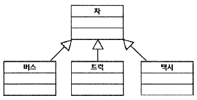

##### UML 모델에서 한 객체가 다른 객체에게 오퍼레이션을 수행하도록 지정하는 의미적 관계로 옳은 것은?     
1. Dependency
2. <mark>Realization</mark>
3. Generalization
4. Association

##### UML 모델에서 한 사물의 명세가 바뀌면 다른사물에 영향을 주며, 일반적으로 한 클래스가다른 클래스를 오퍼레이션의 매개변수로 사용하는 경우에 나타나는 관계는?    
1. Association
2. <mark>Dependency</mark>
3. Realization
4. Generalization

##### UML의 기본 구성요소가 아닌 것은?     
1. Things
2. <mark>Terminal</mark>
3. Relationship
4. Diagram

##### UML에서 시퀀스 다이어그램의 구성 항목에 해당하지 않는 것은?    
1. 생명선
2. 실행
3. <mark>확장</mark>
4. 메시지

##### UML에서 활용되는 다이어그램 중, 시스템의 동작을 표현하는 행위(Behavioral) 다이어그램에 해당하지 않는 것은?     
1. 유스케이스 다이어그램(Use Case Diagram)
2. 시퀀스 다이어그램(Sequence Diagram)
3. 활동 다이어그램(Activity Diagram)
4. <mark>배치 다이어그램(Deployment Diagram)</mark>

##### 아래의 UML 모델에서 '차' 클래스와 각 클래스의 관계로 옳은 것은?         

1. 추상화 관계
2. 의존 관계
3. <mark>일반화 관계</mark>
4. 그룹 관계

UML 모델에서 사용하는 Structural Diagram 에 속하지 않은 것은?     
1. Class Diagram
2. Object Diagram
3. Component Diagram
4. <mark>Activity Diagram</mark>

