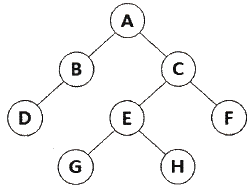

 <br/>
<mark></mark>

###### 21년 필기 2회차 10번
##### 4. CASE(Computer-Aided Software Engineering)의 원천 기술이 아닌 것은?
1. 구조적 기법
2. 프로토타이핑 기술
3. 정보 저장소 기술
4. <mark>일괄처리 기술</mark>

#

###### 22년 필기 2회차 16번
##### 6. UI와 관련된 기본 개념 중 하나로, 시스템의 상태와 사용자의 지시에 대한 효과를 보여주어 사용자가 명령에 대한 진행 상황과 표시된 내용을 해석할 수 있도록 도와주는 것은?     
1. <mark>Feedback</mark>
2. Posture
3. Module
4. Hash

#

###### 20년 필기 3회차 20번
##### 9. 인터페이스 요구 사항 검토 방법에 대한 설명이 옳은 것은?     
1. 리팩토링 : 작성자 이외의 전문 검토 그룹이 요구사항 명세서를 상세히 조사하여 결함, 표준 위배, 문제점 등을 파악
2. <mark>동료검토 : 요구 사항 명세서 작성자가 요구 사항 명세서를 설명하고 이해관계자들이 설명을 들으면서 결함을 발견</mark>
3. 인스펙션 : 자동화된 요구 사항 관리 도구를 이용하여 요구 사항 추적성과 일관성을 검토
4. CASE 도구 : 검토 자료를 회의 전에 배포해서 사전 검토한 후 짧은 시간 동안 검토 회의를 진행하면서 결함을 발견

> 설명 옳지 않는 것인 줄 알고 1번 맞네~하고 선택해버림..

#

###### 21년 필기 3회차 17번
##### 10. 객체지향 분석 기법과 관련한 설명으로 틀린것은?     
1. 동적 모델링 기법이 사용될 수 있다.
2. <mark>기능 중심으로 시스템을 파악하며 순차적인처리가 중요시되는 하향식(Top-down)방식으로 볼 수 있다.</mark>
3. 데이터와 행위를 하나로 묶어 객체를 정의내리고 추상화시키는 작업이라 할 수 있다.
4. 코드 재사용에 의한 프로그램 생산성 향상 및 요구에 따른 시스템의 쉬운 변경이 가능하다.

#

###### 21년 필기 2회차 8번
##### 16. 소프트웨어 아키텍처 설계에서 시스템 품질속성이 아닌 것은?    
1. 가용성 (Availability)
2. <mark>독립성 (Isolation)</mark>
3. 변경 용이성 (Modifiability)
4. 사용성(Usability)

#

###### 20년 필기 1, 2회차 31번
##### 23.다음 트리의 차수(degree)와 단말 노드(terminal node)의 수는?         
 <br/>

1. 차수: 4, 단말 노드: 4
2. <mark>차수: 2, 단말 노드: 4</mark>
3. 차수: 4, 단말 노드: 8
4. 차수: 2, 단말 노드: 8

#

###### 21년 필기 1회차 25번
##### 26.그래프의 특수한 형태로 노드(Node)와 선분(Branch)으로 되어 있고, 정점 사이에 사이클(Cycle)이 형성되어 있지 않으며, 자료 사이의 관계성이 계층 형식으로 나타나는 비선형 구조는?     
1. <mark>tree</mark>
2. network
3. stack
4. distributed

#

###### 21년 필기 2회차 29번
##### 다음 설명의 소프트웨어 버전 관리도구 방식은?

- 버전관리 자료가 원격저장소와 로컬 저장소에 함께 저장되어 관리된다.
- 로컬 저장소에서 버전관리가 가능하므로 원격 저장소에 문제가 생겨도 로컬 저장소의 자료를 이용하여 작업할 수 있다.
- 대표적인 버전 관리 도구로 Git이 있다.

① 단일 저장소 방식<br>
② <mark>분산 저장소 방식</mark><br>
③ 공유폴더 방식<br>
④ 클라이언트·서버 방식<br>

#

###### 20년 필기 1, 2회차 25번
##### 25. EAI(Enterprise Application Integration)의 구축 유형으로 옳지 않은 것은?
① Point-to-Point<br>
② Hub&Spoke<br>
③ Message Bus<br>
④ <mark>Tree</mark><br>

#

###### 21년 필기 1회차 30번
##### 30. 자료구조에 대한 설명으로 틀린 것은?
① <mark>큐는 비선형구조에 해당한다.</mark><br>
② 큐는 First In – First Out 처리를 수행한다.<br>
③ 스택은 Last In – First out 처리를 수행한다.<br>
④ 스택은 서브루틴 호출, 인터럽트 처리, 수식 계산 및 수식 표기법에 응용된다.<br>

#

###### 21년 필기 2회차 25번
##### 25. 소프트웨어 테스트와 관련한 설명으로 틀린것은?
① 화이트 박스 테스트는 모듈의 논리적인 구조를 체계적으로 점검할 수 있다.<br>
② 블랙박스 테스트는 프로그램의 구조를고려하지 않는다.<br>
③ 테스트 케이스에는 일반적으로 시험 조건,테스트 데이터, 예상 결과가 포함되어야한다.<br>
④ <mark>화이트박스 테스트에서 기본 경로(BasisPath)란 흐름 그래프의 시작 노드에서 종료노드까지의 서로 독립된 경로로 싸이클을 허용하지 않는 경로를 말한다.</mark><br>

#

###### 20년 필기 1, 2회차 53번
##### 53. 데이터베이스 시스템에서 삽입, 갱신, 삭제 등의 이벤트가 발생할 때마다 관련 작업이 자동으로 수행되는 절차형 SQL은?
① <mark>트리거(rtigger)</mark><br>
② 무결성(integrity)<br>
③ 잠금(lock)<br>
④ 복귀(rollback)<br>

#
###### 20년 필기 3회차 59번
##### 59. 릴레이션 조작 시 데이터들이 불필요하게 중복되어 예기치 않게 발생하는 곤란한 현상을 의미하는 것은?
① normalization<br>
② rollback<br>
③ cardinality<br>
④ <mark>anomaly</mark><br>

#

###### 20년 필기 3회차 42번
##### 42. 다음 관계형 데이터 모델에 대한 설명으로 옳은 것은?     

|고객ID|고객이름|거주도시|
|---|---|---|
|S1|	홍길동|	서울|
|S2|	이정재|	인천|
|S3|	신보라|	인천|
|S4|	김흥국|	서울|
|S5|	도요새|	용인|

① relation 3개, attribute 3개, tuple 5개<br>
② relation 3개, attribute 5개, tuple 3개<br>
③ relation 1개, attribute 5개, tuple 3개<br>
④ <mark>relation 1개, attribute 3개, tuple 5개</mark><br>


#

###### 20년 필기 4회차 56번
##### 56. 제 3정규형에서 보이스코드 정규형(BCNF)으로 정규화하기 위한 작업은?
① 원자 값이 아닌 도메인을 분해<br>
② 부분 함수 종속 제거<br>
③ 이행 함수 종속 제거<br>
④ <mark>결정자가 후보키가 아닌 함수 종속 제거</mark><br>

#

###### 22년 필기 1회차 55번
##### 55. 트랜잭션의 상태 중 트랜잭션의 수행이 실패하여 Rollback 연산을 실행한 상태는?
① <mark>철회(Aborted)</mark><br>
② 부분 완료(Partially Committed)<br>
③ 완료(Commit)<br>
④ 실패(Fail)<br>

#

###### 20년 필기 1, 2회차 73번
##### 73. HRN(Highest Response-ratio Next) 스케줄링 방식에 대한 설명으로 옳지 않은 것은?
① <mark>대기 시간이 긴 프로세스의 경우 우선 순위가 높아진다.</mark><br>
② SJF 기법을 보완하기 위한 방식이다.<br>
③ 긴 작업과 짧은 작업 간의 지나친 불평등을 해소할 수 있다.<br>
④ 우선 순위를 계산하여 그 수치가 가장 낮은 것부터 높은 순으로 우선 순위가 부여된다.<br>

#

###### 20년 필기 1, 2회차 61번
##### 61. IPv6에 대한 설명으로 틀린 것은?
① 128비트의 주소 공간을 제공한다.<br>
② 인증 및 보안 기능을 포함하고 있다.<br>
③ <mark>패킷 크기가 64Kbyte로 고정되어 있다.</mark><br>
④ IPv6 확장 헤더를 통해 네트워크 기능 확장이 용이하다.<br>

###### 2020년 3회 64번
##### 64. IPv6에 대한 설명으로 틀린 것은?
① 32비트의 주소체계를 사용한다.<br>
② 멀티미디어의 실시간 처리가 가능하다.<br>
③ IPv4보다 보안성이 강화되었다.<br>
④ 자동으로 네트워크 환경구성이 가능하다.<br>

###### 2021년 1회 67번
##### 67. IPv6에 대한 설명으로 틀린 것은?
① 멀티캐스팅(Multicast) 대신 브로드캐스트(Broadcast)를 사용한다.<br>
② 보안과 인증 확장 헤더를 사용함으로써 인터넷 계층의 보안기능을 강화하였다.<br>
③ 애니캐스트(Anycast)는 하나의 호스트에서 그룹 내의 가장 가까운 곳에 있는 수신자에게 전달하는 방식이다.<br>
④ 128비트 주소체계를 사용한다.<br>

#

###### 21년 필기 1회차 79번
##### 79. 다음은 파이썬으로 만들어진 반복문 코드이다. 이 코드의 결과는?

```Python
>> while(True) ：
print('A')
print(’B‘)
print(’C‘)
continue
print(’D‘)
```

① <mark>A, B, C 출력이 반복된다.</mark><br>
② A, B, C까지만 출력된다.<br>
③ A, B, C, D 출력이 반복된다.<br>
④ A, B, C, D 까지만 출력된다.<br>

#

###### 20년 필기 1, 2회차 87번
##### 87. 크래커가 침입하여 백도어를 만들어 놓거나, 설정 파일을 변경했을 때 분석하는 도구는?
① trace<br>
② <mark>tripwire</mark><br>
③ udpdump<br>
④ cron<br>

#

###### 
##### 100. 소프트웨어 개발 방법론의 테일러링(Tailoring)과 관련한 설명으로 틀린 것은?
① <mark>프로젝트 수행 시 예상되는 변화를 배제하고 신속히 진행하여야 한다.</mark><br>
② 프로젝트에 최적화된 개발 방법론을 적용하기 위해 절차, 산출물 등을 적절히 변경하는 활동이다.<br>
③ 관리 측면에서의 목적 중 하나는 최단기간에 안정적인 프로젝트 진행을 위한 사전 위험을 식별하고 제거하는 것이다.<br>
④ 기술적 측면에서의 목적 중 하나는 프로젝트에 최적화된 기술 요소를 도입하여 프로젝트 특성에 맞는 최적의 기법과 도구를 사용하는 것이다.<br>

#

###### 22년 필기 1회차 100번
##### 81. Rayleigh-Norden 곡선의 노력 분포도를 이용한 프로젝트 비용 산정기법은?
① <mark>Putnam 모형</mark><br>
② 델파이 모형<br>
③ COCOMO 모형<br>
④ 기능점수 모형<br>

#

###### 21년 필기 1회차 94번
##### 94. 스트림 암호화 방식의 설명으로 옳지 않은 것은?
① 비트/바이트/단어들을 순차적으로 암호화한다.<br>
② <mark>해쉬 함수를 이용한 해쉬 암호화 방식을 사용한다.</mark><br>
③ RC4는 스트림 암호화 방식에 해당한다.<br>
④ 대칭키 암호화 방식이다.<br>

#

###### 20년 필기 3회차 91번
##### 91. DDoS 공격과 연관이 있는 공격 방법은?
① Secure shell<br>
② <mark>Tribe Flood Network</mark><br>
③ Nimda<br>
④ Deadlock<br>
